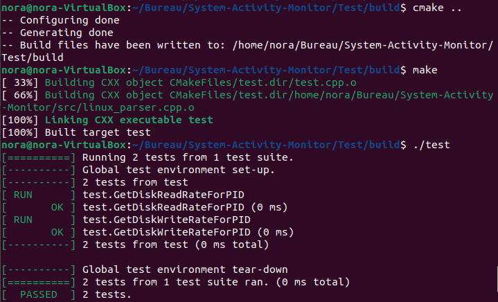
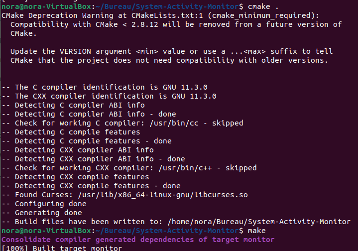

# System-Activity-Monitor
This is a simple system activity monitor written in c++.

## Project Overview

This project aims to :
* Build a system monitor for Linux like htop using C++ with ncurses library.
* Bonus: OS, Kernel, Total Processes and Uptime, Unit Testing with gtest framework.
  
The project is divided into different files:
* `src/main.cpp`: Calls the system and ncurses logic.
* `src/format.cpp` and `include/format.h`: Functions for string formatting (time format).
* `src/ncurses_display.cpp`  and `include/ncurses_display.h`: Functionality for displaying results in the terminal
* `src/linux_parser.cpp` and `include/linux_parser.h`: Functions to read data from the file system of Linux
* `src/system.cpp` and `include/system.h`: Class for system data and logic
* `src/process.cpp` and `include/process.h`: Class for process data and logic
* `src/processor.cpp` and `include/processor.h`: Class for processor data and logic
* `Test/test.cpp` : Class for unit testing for GetDiskReadRateForPID() and GetDiskWriteRateForPID().
* others, build and installation files.
* Note that all header files can be found in `include` folder.

## Dependencies
This project needs the following dependencies:

* Linux based OS with Linux >= 2.6
* cmake >= 3.11.3
* make >= 4.1 
* gcc/g++ >= 7.4.0
* ncurses
  * (https://ostechnix.com/how-to-install-ncurses-library-in-linux/) is a library that facilitates text-based graphical output in the terminal.
  * Use `sudo apt install libncurses5-dev libncursesw5-dev` to install ncurses (For Ubuntu or Debian-based systems)
* gtest framework is Google's C++ testing and mocking framework.
   * sudo apt-get install libgtest-dev (For Ubuntu or Debian-based systems)
   * Visit the Google Test GitHub repository (https://github.com/google/googletest) and download the source code either by cloning the repository or downloading a release tarball

## Basic Build and Run Instructions
1. Clone this repository.
2. Install dependencies.
3. To run the tests, delete the file CMakeCache.txt in "System-Activity-Monitor/Test/build".
   * At System-Activity-Monitor/Test/build, run the command `cmake ..`, then `make`, then `./test`
                     
6. To run the system monitor, delete the file CMakeCache.txt in "System-Activity-Monitor/".
   *  At System-Activity-Monitor/, run the command `cmake .`, then `make`, then `./monitor`
                     

## Result
Here you can see an example result (from my Linux VM):

